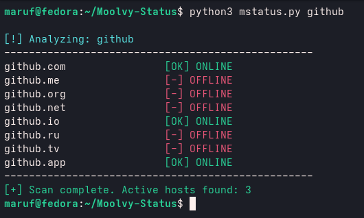

# Moolvy-Status
* Moolvy-Status is a fast and lightweight console tool for instantly checking the availability of domains in various zones.
------------
# Installation
1. git clone https://github.com/Moolvy/Moolvy-Status.git
2. pip install -r requirements.txt
3. open home/name/mstatus.py
4. bash: python3 mstatus.py domain.
5.  

------------
* Automatically scans popular domain extensions (.com, .net, .io, .ru, etc.).​
   Color-coded [OK] and [OFFLINE] statuses for easy reading.

-------------

